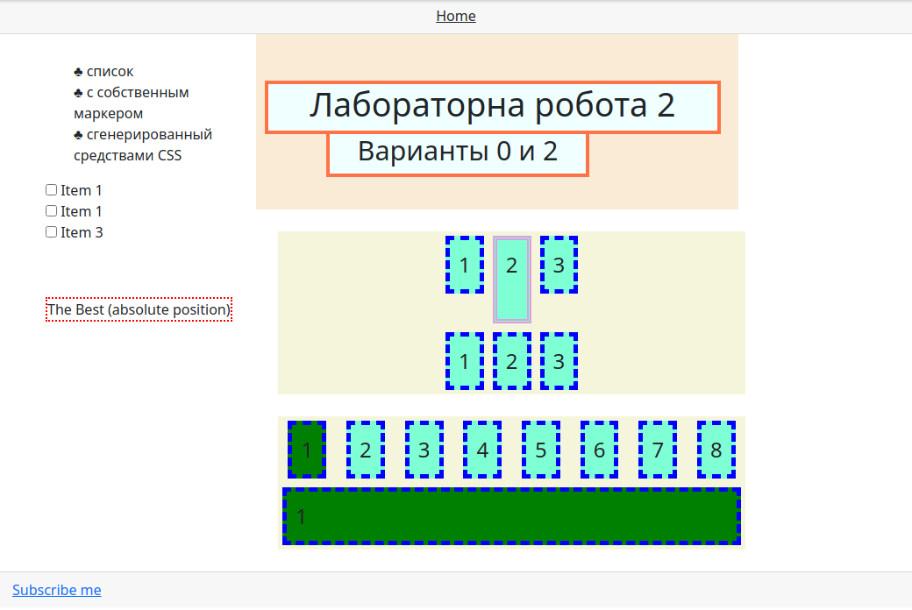

# web development course (lab-work2)
## Cascade Style Sheets (CSS)
### Task

Show three ways of using CSS:
1. inline description (using the style attribute)
2. using the style container in the header section
3. connect the style sheet located in the external file

Use absolute and relative positioning.
Use floating model (float property).

Add a list of checkboxes to the page, the design of which depends on their state.
Add a container to the page with elements placed according to the [picture](task-flex.png). Use flexbox.

---

# Курс по веб-разработки (лабораторная работа2)
## Каскадные таблицы стилей
### Задание

Показать три способа использования CSS:
1. inline-описание (используется атрибут style)
2. с помощью контейнера style в секции заголовка
3. подключить стилевую таблицу, расположенную во внешнем файле

Показать использование абсолютного и относительного позиционирования.
Показать использование плавающей модели (свойство float).

Добавить на страницу список флажков (checkbox), оформление которых зависит от их состояния.
Добавить на страницу контейнер с элементами, размещенными согласно [рисунку](task-flex.png). Использовать Flexbox.

---

## Result:
